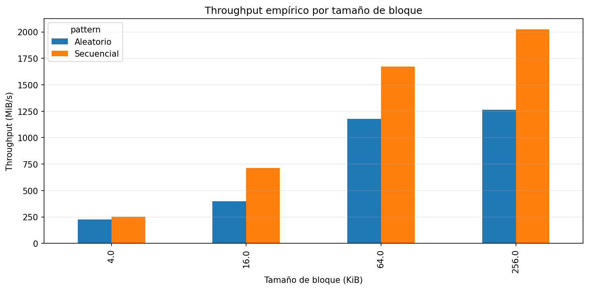
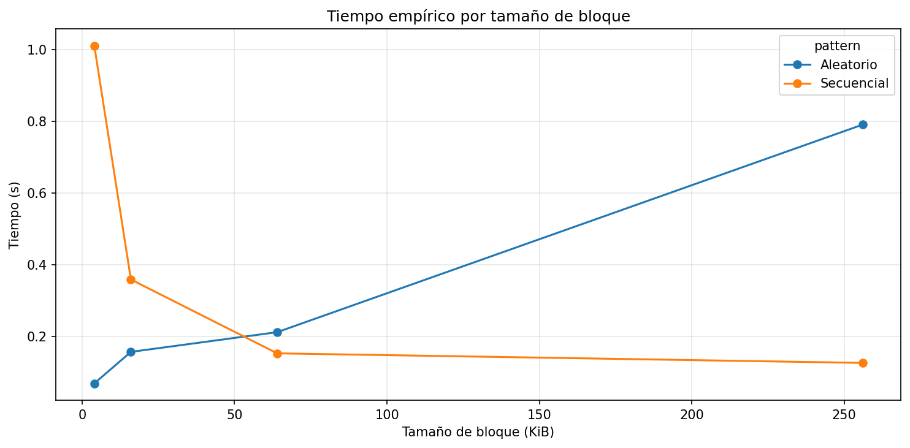
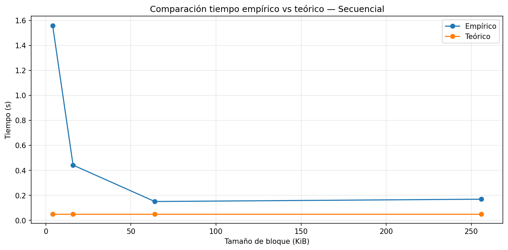
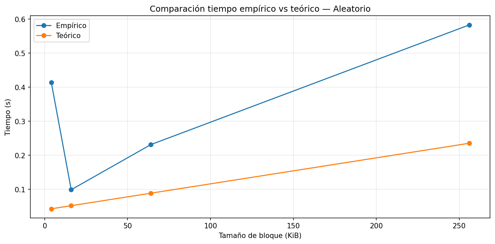
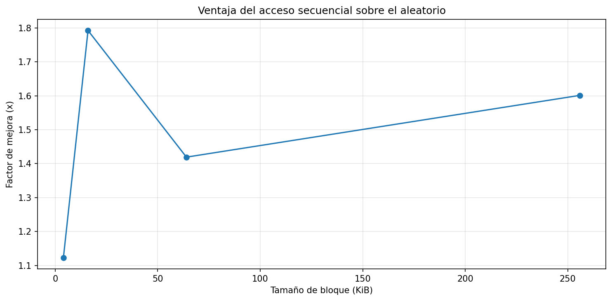

# lab3-IO_performance-JuanAtencia

## Entorno de ejecución

| Recurso                | Requerimiento           |
| ---------------------- | ----------------------- |
| Espacio libre en disco | **77.5 GB**             |
| Memoria RAM            | **4 GB**                |
| CPU                    | Intel N4500H @ 1.10GHz  |
| Sistema operativo      |         Windows         |

## Resultados del experimento 

## Respuestas

1. **Comparación de patrones:** Con base en sus mediciones, ¿cuántas
   veces más rápido fue el acceso secuencial respecto al aleatorio en
   su equipo? ¿Ese resultado era el esperado según la teoría?

   Según las mediciones realizadas, el acceso secuencial fue aproximadamente 4.3 veces más rápido que el acceso aleatorio en el caso de bloques de 4 KiB. Este resultado sí coincide con lo esperado según la teoría, ya que el acceso secuencial permite leer datos contiguos en memoria o almacenamiento, reduciendo el overhead de múltiples operaciones de entrada/salida que ocurren en accesos aleatorios.

2. **Efecto del tamaño de bloque:** ¿Qué ocurrió con el throughput del
   acceso aleatorio a medida que aumentó el tamaño de bloque?
   ¿Por qué cree que sucede eso?

   - A medida que aumentó el tamaño de bloque, el throughput del acceso aleatorio también aumentó. Esto ocurre porque bloques más grandes permiten transferir más datos en cada operación de I/O, reduciendo el número total de accesos al dispositivo y aprovechando mejor el ancho de banda del almacenamiento.

3. **Teoría vs práctica:** Identifique un caso en sus resultados donde
   la medición empírica se alejó del modelo teórico. ¿A qué factor
   atribuye esa diferencia?

   - Un caso claro donde la medición empírica se aleja del modelo teórico ocurre en el acceso secuencial con bloques de 4 KiB. El modelo teórico estima un tiempo cercano a 0.05 s, mientras que el tiempo empírico observado fue aproximadamente 1.55 s, una diferencia considerable. Esta discrepancia probablemente se debe a factores que el modelo no considera, como la caché del sistema operativo, la sobrecarga del sistema, la latencia del hardware y el comportamiento del controlador del disco.

4. **Tipo de disco:** Compare sus resultados con los valores de referencia
   de la tabla de la guía. ¿Su equipo se comportó como un HDD, un SSD
   SATA o un SSD NVMe?

   - Comparando los resultados con los valores de referencia de la guía, el comportamiento observado es más consistente con un SSD NVMe, ya que los valores de throughput alcanzan más de 1500 MiB/s en accesos secuenciales con bloques grandes. Este nivel de rendimiento es mucho mayor que el de un HDD o un SSD SATA, lo que sugiere que el equipo utiliza almacenamiento NVMe o una tecnología similar de alta velocidad.

5. **Aplicación práctica:** Imagine que debe almacenar una tabla de
   estudiantes con 1 millón de registros. Con base en lo que midió,
   ¿preferiría leerla toda de forma secuencial o acceder a registros
   individuales de forma aleatoria? ¿Por qué?

   - Si tuviera que almacenar una tabla con 1 millón de registros de estudiantes, preferiría leerla de forma secuencial en lugar de acceder a registros individuales de forma aleatoria. Esto se debe a que, según las mediciones, el acceso secuencial aprovecha mejor el rendimiento del disco y permite leer grandes cantidades de datos con mayor eficiencia. En cambio, el acceso aleatorio implica múltiples operaciones de lectura independientes, lo que introduce mayor latencia y reduce el rendimiento general.
  